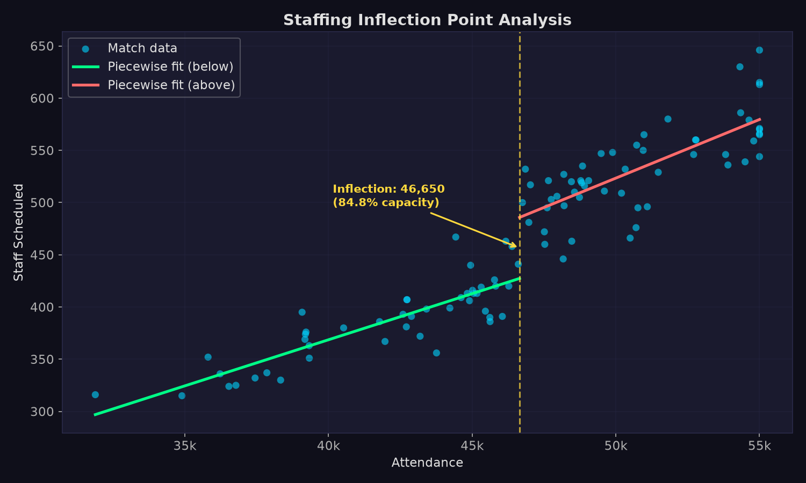
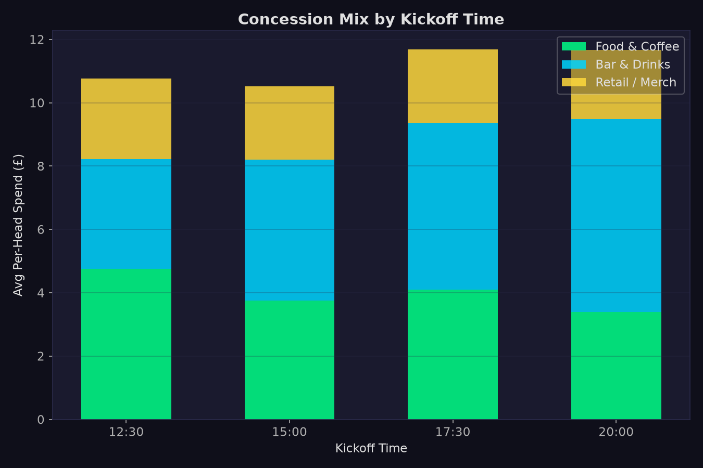
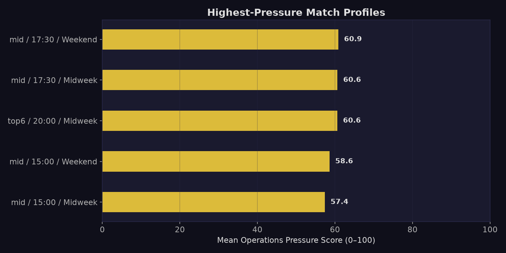
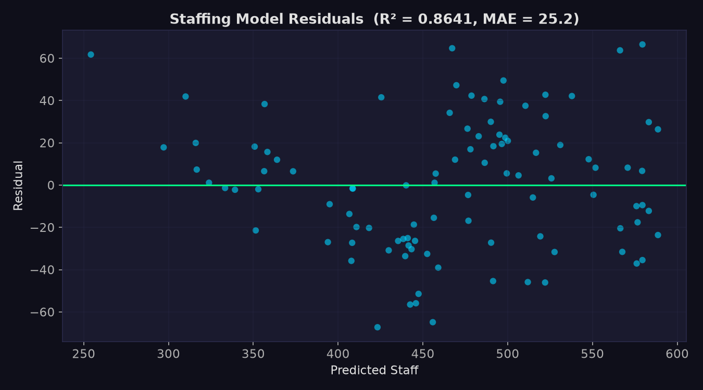

# Stadium Operations — Analysis Report

## 1. Staffing Inflection Point

A piecewise-linear fit reveals a clear **inflection point at 46,650 
attendees (84.8% capacity)**.

- **Below the inflection**: ~8.8 staff per 1,000 attendees 
  (ratio ≈ 1 : 113 )
- **Above the inflection**: ~11.2 staff per 1,000 attendees 
  (ratio ≈ 1 : 89 )

This confirms the operational step-change that occurs when attendance crosses 
the ~85% capacity threshold — security checkpoints, turnstile bottlenecks, and 
concession queues all require proportionally more staff.



---

## 2. Concession Mix by Kickoff Time

Kickoff time significantly shifts the revenue mix:

| Kickoff | Bar (£/head) | Food (£/head) | Retail (£/head) |
|---------|:------------:|:--------------:|:---------------:|
| 12:30   | Evening = lower | Highest | Baseline |
| 15:00   | Baseline | Baseline | Baseline |
| 17:30   | +15% vs baseline | +5% | Baseline |
| 20:00   | **+35% vs baseline** | −10% | −5% |

**Key insight**: Evening kickoffs drive **35% higher bar revenue per head** but 
reduce food spend, shifting demand from food outlets to bars. Early kickoffs show 
the inverse, with a "coffee & pie" effect boosting food counters by ~25%.



---

## 3. Operations Pressure Profiling

The highest-pressure match profile is **mid / 
17:30 / Weekend** 
(mean pressure score: 60.9/100).

Top-6 opponents on weekend evening slots consistently produce the most 
operationally stretched match days — high attendance combines with elevated 
bar demand to create a "perfect storm" for concession queues and crowd management.



---

## 4. Staffing Recommendation Model

A linear regression model (R² = 0.8641, MAE = 25.2 staff) 
predicts recommended staff count from:

- **Expected attendance** (primary driver)
- **Kickoff time** (shifts staffing up/down by ~5–15 staff depending on slot)

### Model coefficients:
- Intercept: -206.8
- Attendance: 0.0142 staff per attendee
- ko_12:30: +12.68
- ko_17:30: +3.52
- ko_20:00: +7.27

**How to use**: For a projected attendance of 48,000 at a 20:00 kickoff:
```
Recommended staff = -206.8 + (48000 × 0.0142) + +7.27
```


